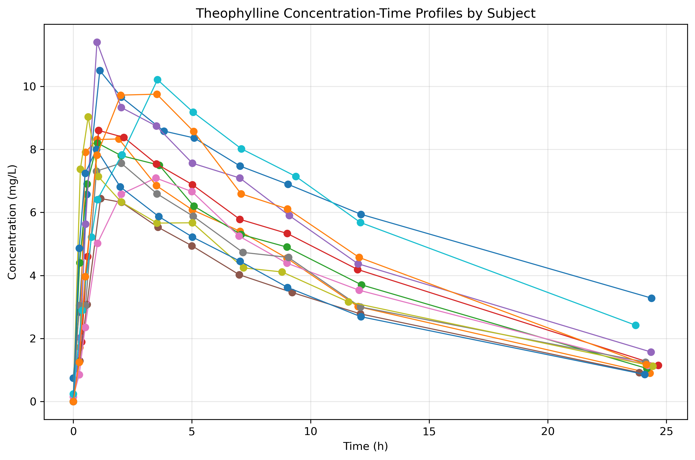
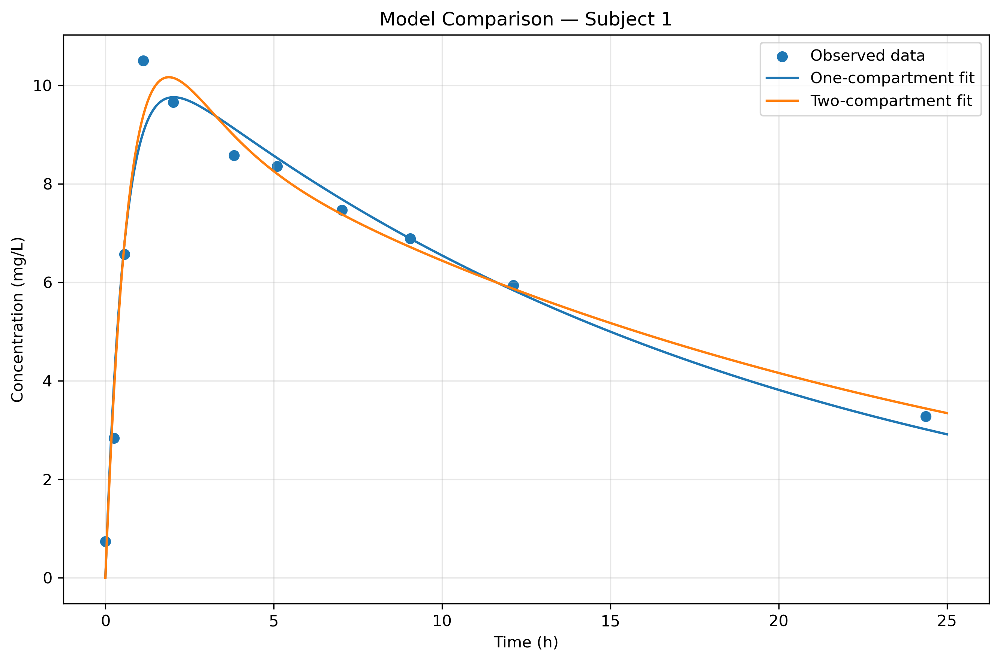
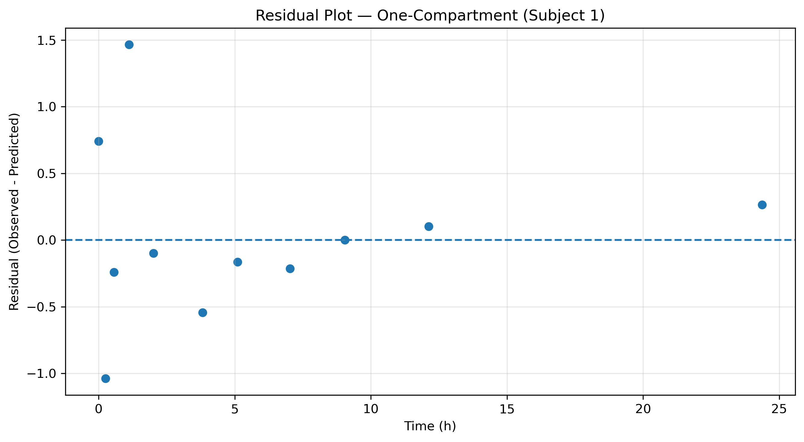

# Pharmacokinetic Modeling and Model Comparison in Python


---

## Overview

This project implements and compares **one-compartment** and **two-compartment oral pharmacokinetic (PK) models** using real-world theophylline concentration-time data.

The analysis integrates pharmacokinetic theory with Python-based data science tools to:
- estimate drug disposition parameters
- evaluate model performance
- compare model complexity vs predictive accuracy

---

## Research Objective

This study aims to determine whether a **two-compartment model** provides a significantly better representation of oral theophylline pharmacokinetics than a **one-compartment model**.

### Research Question
Does a two-compartment model improve fit compared to a one-compartment model for oral theophylline data?

### Hypothesis
While the two-compartment model may provide improved statistical fit, the one-compartment model may remain preferable due to its simplicity and interpretability.

---

## Clinical Context

Theophylline is a bronchodilator used in respiratory disease management.

- Narrow therapeutic window  
- High inter-individual variability  
- Requires careful dose optimization  

Pharmacokinetic modeling helps quantify:
- absorption
- elimination
- drug exposure (AUC)
- peak concentration (Cmax)

---

## Dataset

This project uses the **Theoph dataset**, a standard pharmacokinetic dataset.

### Dataset Characteristics
- **132 observations**
- **12 subjects**
- **11 time points per subject**
- Sampling over **25 hours** post-dose

### Variables
- `Subject`: subject ID  
- `Wt`: body weight (kg)  
- `Dose`: dose (mg/kg)  
- `Time`: time after dose (hours)  
- `conc`: plasma concentration (mg/L)  

---

## Methods

### 1. Exploratory Data Analysis
- Visualization of concentration-time profiles
- Assessment of variability across subjects

### 2. One-Compartment Model
- First-order absorption and elimination
- Nonlinear regression using SciPy

### 3. Two-Compartment Model
- Includes distribution phase
- Additional parameters for flexibility

### 4. Parameter Estimation
Estimated parameters include:
- absorption rate constant (ka)
- elimination rate constant (ke)
- volume of distribution (V/F)

### 5. Model Evaluation
Models were evaluated using:
- **RMSE (Root Mean Squared Error)**
- **MAE (Mean Absolute Error)**
- **R² (Coefficient of Determination)**

### 6. Model Selection
Model complexity was assessed using:
- **AIC (Akaike Information Criterion)**
- **BIC (Bayesian Information Criterion)**

---

## Key Results

- The **one-compartment model** adequately described the general PK profile.
- The **two-compartment model** improved fit in some cases, particularly during early distribution.
- However, **model selection criteria (AIC/BIC)** often favored the simpler model.

### Key Insight
> Increased model complexity does not always lead to better overall performance when penalized for additional parameters.

---

## Inter-Individual Variability

Significant variability was observed across subjects in:
- half-life
- peak concentration (Cmax)
- volume of distribution

This highlights the importance of:
- personalized dosing
- variability-aware pharmacokinetic modeling

---

## Example Figures

### Concentration-Time Profiles


### Model Comparison


### Residual Analysis


---

## Repository Structure
pk-modeling-project/
├── pk_modeling_final.ipynb # Main analysis notebook
├── README.md # Project description
├── requirements.txt # Dependencies
├── .gitignore
├── LICENSE
├── pk_subject_summary_with_gof.csv # Subject-level results
├── pk_model_comparison_all_subjects.csv
├── pk_subject1_metrics.csv
├── pk_subject1_residuals.csv
└── figures/ # Saved plots

---

## How to Run

### 1. Clone the repository
```bash
git clone https://github.com/pafr4149/pk-modeling-project.git
cd pk-modeling-project

### 2. Create a virtual environment
```bash
python -m venv venv

### 3. Activate environment
```bash
Windows
venv\Scripts\activate

### 4. Install dependencies
```bash
pip install -r requirements.txt

### 5. Run notebook
```bash
jupyter notebook
Open:
pk_modeling_final.ipynb

---

## Tools and Technologies
•	Python 
•	pandas 
•	numpy 
•	matplotlib 
•	scipy 
•	scikit-learn 
•	Jupyter Notebook 

---

## Limitations
•	Small sample size 
•	Simplified compartmental assumptions 
•	No covariate modeling 
•	Parameter estimation sensitivity 

---

## Future Work
•	Population pharmacokinetic modeling 
•	Covariate analysis 
•	Bayesian PK modeling 
•	Machine learning prediction of PK parameters 

---

## Portfolio Value
This project demonstrates:
•	pharmacokinetic modeling expertise 
•	nonlinear regression implementation 
•	statistical model evaluation 
•	integration of pharmacy and data science 

---

## CV Entry
Pharmacokinetic Modeling and Model Comparison in Python
Developed one-compartment and two-compartment oral PK models using nonlinear regression, estimated pharmacokinetic parameters, and evaluated model performance using RMSE, MAE, R², AIC, and BIC.

---

## License
MIT License

---